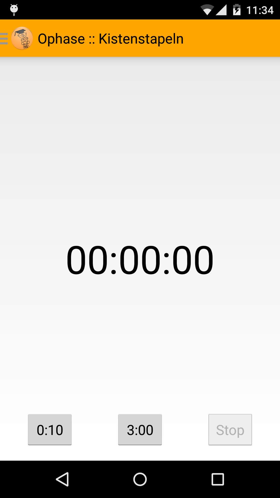
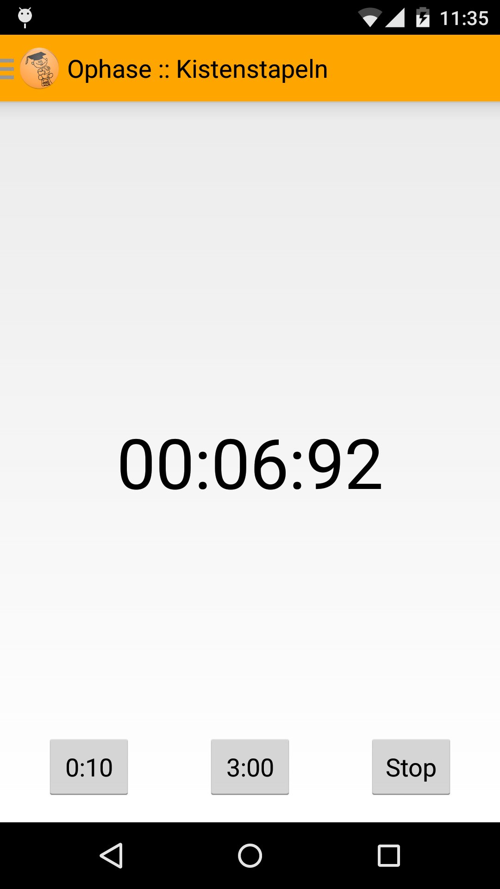
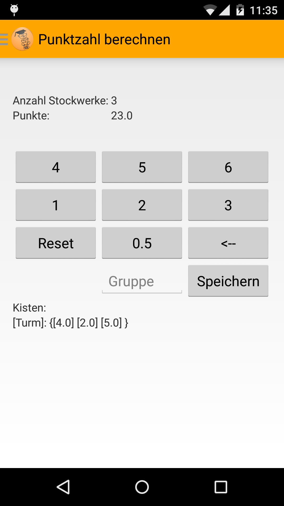
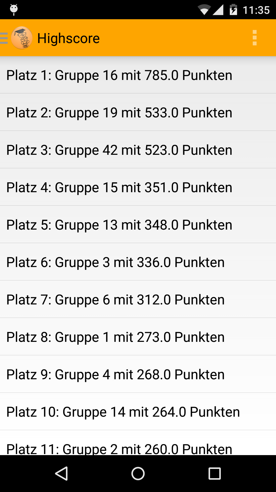
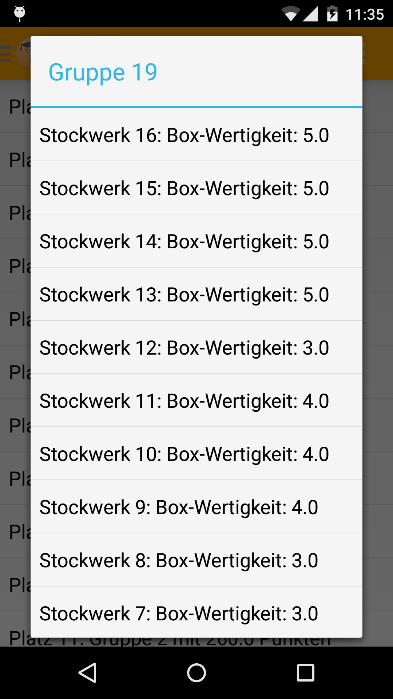
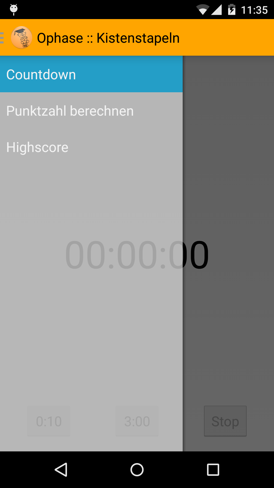

# Kistenstapeln-Android
Android App for the evaluation of a simple box stacking game.

## Download & Install
You could simply install "Kistenstapeln-Android" by downloading the release APK or using the app in available stores.
Amazon and Github versions are both signed by developers private key, the version on Fdroid is signed by key generated by fdroid.

[](http://www.amazon.com/TN-D120-Kistenstapeln/dp/B00V29ZX0U)
[](https://f-droid.org/repository/browse/?fdid=de.d120.ophasekistenstapeln)
[Release on Github](https://github.com/d120/Kistenstapeln-Android/releases)

## Screenshots
**The countdown interface**




**The calculation interface**



**The highscore interface**




**The navigationdrawer**



## Licence
```
This file is part of Ophasenkistenstapeln.

Ophasenkistenstapeln is free software: you can redistribute it and/or modify
it under the terms of the GNU General Public License as published by
the Free Software Foundation, either version 3 of the License, or
(at your option) any later version.

Ophasenkistenstapeln is distributed in the hope that it will be useful,
but WITHOUT ANY WARRANTY; without even the implied warranty of
MERCHANTABILITY or FITNESS FOR A PARTICULAR PURPOSE.  See the
GNU General Public License for more details.

You should have received a copy of the GNU General Public License
along with Ophasenkistenstapeln.  If not, see <http://www.gnu.org/licenses/>.
```
